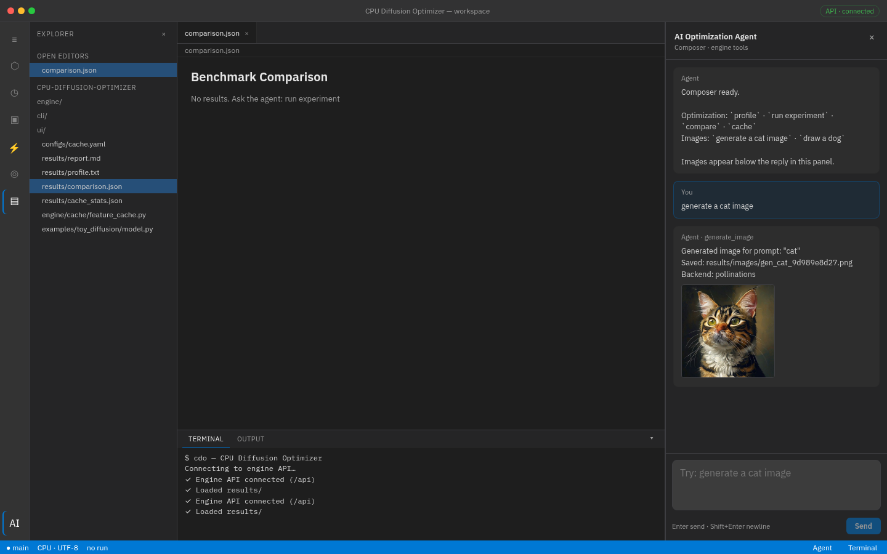

# CPU Diffusion Optimizer

CPU-first engine for analyzing, profiling, and optimizing **diffusion-model inference** on CPUs.

<p align="center">
  
</p>

**Developer UI** — Cursor-like workspace with explorer, benchmark view, terminal, and the **AI Optimization Agent**. Image chat supports **many offline CPU models** via `configs/txt2img_models.yaml` (`list models` · `use model sdxs` · `generate a cat with sd-turbo`). Install Diffusers with `pip install -e ".[diffusers]"`.

## Sample outputs

Offline CPU generation via the agent (`generate a cat image` / `draw a dog`):

| Cat | Dog |
|-----|-----|
|  |  |

| Generated cat | Generated dog |
|---------------|---------------|
|  |  |


This is **not** primarily an image-generation UI. The core product is an **optimization engine** that:

1. Loads a diffusion model
2. Builds a normalized computation graph
3. Profiles inference on CPU
4. Detects hotspots
5. Plans optimizations (caching, quantization, …)
6. Runs controlled experiments
7. Benchmarks and quality-checks every change
8. Accepts or rejects the optimization based on measured evidence

```
UI ──► API ──► Engine
Agent ───────► Engine
CLI ─────────► Engine
```

The engine never depends on the UI or agent. The CLI and library APIs work standalone.

## Status

Working vertical slice (Phase 2 cache wired):

- Toy diffusion model on CPU
- Model graph + CPU profiler
- Baseline vs **CPU-aware adaptive block cache**
- Quality gate (MSE / PSNR) → keep / reject / inconclusive
- Latent visualization images under `results/images/`

```bash
python -m venv .venv
source .venv/bin/activate

# CPU-only PyTorch (required — do not pull the default CUDA wheel from PyPI)
pip install torch --index-url https://download.pytorch.org/whl/cpu
pip install -e ".[dev]"

# Full pipeline
python -m cli experiment --config configs/cache.yaml
```

Outputs:

```
results/
├── baseline.json
├── optimized.json
├── comparison.json
├── report.md
├── cache_stats.json
├── cache_log.json
└── images/
    ├── baseline.png
    └── optimized.png
```

Other commands:

```bash
python -m cli analyze --model toy
python -m cli profile --model toy
python -m cli benchmark --model toy
```

## UI + Agent

```bash
# Terminal 1 — engine API
python -m engine.api

# Terminal 2 — developer UI
cd ui && npm install && npm run dev
```

Open http://localhost:5173 — use the agent panel (`generate a cat image`, `run experiment`, `profile`, …).

## Architecture layers

| Layer   | Role                                      |
|---------|-------------------------------------------|
| Engine  | Profiling, caching, optimization, benchmarks |
| Agent   | Reasoning over engine tools (Phase 5)     |
| UI      | Developer IDE-like surface (Phase 6)      |
| CLI     | Headless entry point                      |

## CPU-first design

Designed around x86 AVX2 / AVX-512, ARM NEON (where practical), memory bandwidth, RAM pressure, tensor copies, cache locality, threading, operator fusion, INT8 / future INT4. GPU support may arrive later without reshaping the architecture.

## License

Apache-2.0 — see [LICENSE](LICENSE).

## Technical discussion

See [docs/doc.md](docs/doc.md) for architecture, pipeline, caching theory, tradeoffs, and open questions.
